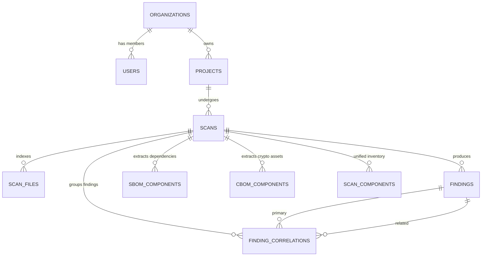

# PQC Security Assessment Platform — Database (Day 4 Integration)

**Owner:** Vamsi (Database Engineer - Person 10)  
**Target Engine:** MySQL 8.0+  
**Database Name:** `pqc_security` (with `pqc` backwards-compatibility alias)  
**Feature Branch:** `day4/vamsi`

---

## 1. Architecture & Entity-Relationship (ER) Overview



---

## 2. Core Tables (10 Tables)

| # | Table Name | Purpose | Primary Key | Foreign Keys / Cascades |
|---|---|---|---|---|
| 1 | `organizations` | Enterprise tenant root | `id` VARCHAR(36) | - |
| 2 | `users` | Platform accounts & auth | `id` CHAR(36) | `organization_id` $\rightarrow$ `organizations.id` (ON DELETE SET NULL) |
| 3 | `projects` | Scanned code repositories | `id` VARCHAR(36) | `organization_id` $\rightarrow$ `organizations.id` (ON DELETE SET NULL) |
| 4 | `scans` | Scan jobs & per-engine lifecycle | `id` CHAR(36) | `project_id` $\rightarrow$ `projects.id` (ON DELETE CASCADE) |
| 5 | `scan_files` | Extracted repository file inventory | `id` CHAR(36) | `scan_id` $\rightarrow$ `scans.id` (ON DELETE CASCADE) |
| 6 | `findings` | Security & crypto engine findings | `id` CHAR(36) | `scan_id` $\rightarrow$ `scans.id` (ON DELETE CASCADE) |
| 7 | `sbom_components` | Software Bill of Materials (dependencies) | `id` CHAR(36) | `scan_id` $\rightarrow$ `scans.id` (ON DELETE CASCADE) |
| 8 | `cbom_components` | Cryptographic Bill of Materials (crypto) | `id` CHAR(36) | `scan_id` $\rightarrow$ `scans.id` (ON DELETE CASCADE) |
| 9 | `finding_correlations`| Primary & related finding groupings | `id` CHAR(36) | `scan_id` $\rightarrow$ `scans.id`, `primary_finding_id`/`related_finding_id` $\rightarrow$ `findings.id` (ON DELETE CASCADE) |
| 10 | `scan_components` | Unified component inventory for API/reports| `id` CHAR(36) | `scan_id` $\rightarrow$ `scans.id` (ON DELETE CASCADE) |

---

## 3. Day 4 Field & Contract Expansions

- **`scans.engine_statuses` (JSON)**: Tracks per-engine progress (`sast`, `crypto`, `dependency`, `configuration`) as `QUEUED`, `ANALYZING`, `COMPLETED`, `FAILED`.
- **`findings` rule & correlation fields**:
  - `rule_id VARCHAR(100)` & `rule_version VARCHAR(50)`
  - `source_engine VARCHAR(50)`
  - `group_key VARCHAR(255)` & `correlation_id VARCHAR(255)` & `correlation_group_id VARCHAR(36)`
- **`cbom_components.quantum_risk` (ENUM)**:
  `quantum_vulnerable`, `weakened`, `safe`, `deprecated`, `unknown`
- **`cbom_components.nist_migration_target` (VARCHAR(255))**:
  Recommended post-quantum standard target (e.g., `ML-KEM (FIPS 203)`).
- **Composite query indexes**:
  - `idx_findings_scan_severity` (`scan_id`, `severity`)
  - `idx_findings_scan_engine` (`scan_id`, `engine`)
  - `idx_findings_scan_category` (`scan_id`, `category`)
  - `idx_findings_rule_id` (`rule_id`)
  - `idx_findings_correlation_group` (`correlation_group_id`)
  - `idx_scans_project_status` (`project_id`, `status`)

---

## 4. Migration Execution

All migrations are fully idempotent and safe to re-run:

```bash
# 1. Baseline Day 1 tables
mysql -u pqc -p pqc_security < database/migrations/001_day1_core_schema.sql

# 2. Day 3 Expansion (SBOM, CBOM, finding correlations)
mysql -u pqc -p pqc_security < database/migrations/002_day3_expansion.sql

# 3. Day 4 Integration (engine_statuses, source_engine, scan_components, indexes)
mysql -u pqc -p pqc_security < database/migrations/003_day4_integration.sql
```

Fresh databases can also be bootstrapped directly with:
```bash
mysql -u pqc -p < database/schema.sql
mysql -u pqc -p pqc_security < database/seed.sql
```

---

## 5. Verification Suite

Run verification script:
```bash
python database/verify_db.py
```

Run test suite:
```bash
pytest tests/database/test_day4_schema.py -v
```
