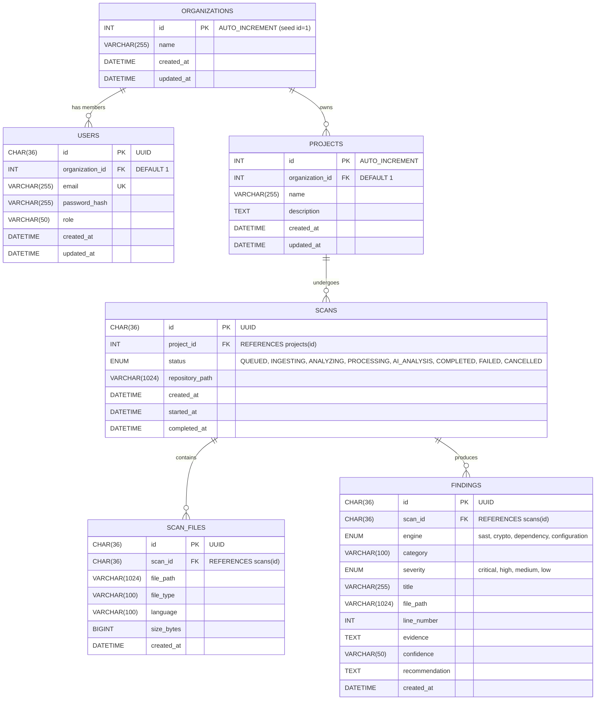

# PQC Security Assessment Platform — Database (Day 1)

**Owner:** Vamsi (Database Engineer)  
**Target Engine:** MySQL 8.0+  
**Database Name:** `pqc_security`  
**Git Branch:** `vamsi`

---

## 1. Architecture & Entity-Relationship (ER) Diagram



---

## 2. Table Specifications & Schema Requirements

### Table: `organizations`
* **Purpose:** Multi-tenant / enterprise organization container.
* **Primary Key:** `id` (`INT AUTO_INCREMENT`, seed organization `id = 1`).

### Table: `users`
* **Purpose:** User identities, authentication records, and authorization roles.
* **Foreign Keys:** `organization_id` &rarr; `organizations.id` (`INT NULL DEFAULT 1`, `ON DELETE SET NULL`).
* **Indexes:**
  * `uq_users_email` (UNIQUE): Fast lookups during login/auth.
  * `idx_users_organization_id`: Lookup all users within an organization.

### Table: `projects`
* **Purpose:** Target software repositories / projects being scanned.
* **Primary Key:** `id` (`INT AUTO_INCREMENT`).
* **Foreign Keys:** `organization_id` &rarr; `organizations.id` (`INT NOT NULL DEFAULT 1`, `ON DELETE RESTRICT`).
* **Indexes:**
  * `idx_projects_organization_id`: Filter projects by organization.
  * `idx_projects_name`: Project listing and search.

### Table: `scans`
* **Purpose:** Scan execution lifecycle and repository reference.
* **Primary Key:** `id` (`CHAR(36)` UUID, `DEFAULT (UUID())`).
* **Foreign Keys:** `project_id` &rarr; `projects.id` (`INT NOT NULL`, `ON DELETE CASCADE`).
* **Important Rule:** `repository_path` stores the filesystem location of the ZIP/extracted directory. **Never store ZIP binaries in MySQL**.
* **Indexes:**
  * `idx_scans_project_id`: Retrieve all scan runs for a given project.
  * `idx_scans_status`: Worker polling for `QUEUED` scans.
  * `idx_scans_created_at`: Sorting scans chronologically.
  * `idx_scans_project_status`: Composite index for filtering a project's active scans.

### Table: `scan_files`
* **Purpose:** File catalog discovered during the ingestion phase.
* **Primary Key:** `id` (`CHAR(36)` UUID, `DEFAULT (UUID())`).
* **Foreign Keys:** `scan_id` &rarr; `scans.id` (`CHAR(36)`, `ON DELETE CASCADE`).
* **Indexes:**
  * `idx_scan_files_scan_id`: Load all files for a scan run.
  * `idx_scan_files_language`: Aggregate code language breakdown.

### Table: `findings`
* **Purpose:** Normalized security, cryptographic, and dependency findings.
* **Primary Key:** `id` (`CHAR(36)` UUID, `DEFAULT (UUID())`).
* **Foreign Keys:** `scan_id` &rarr; `scans.id` (`CHAR(36)`, `ON DELETE CASCADE`).
* **Indexes:**
  * `idx_findings_scan_id`: Query findings for a specific scan.
  * `idx_findings_severity`: Filter by severity (`critical`, `high`, `medium`, `low`).
  * `idx_findings_engine`: Filter by engine (`sast`, `crypto`, `dependency`, `configuration`).
  * `idx_findings_scan_severity`: Composite index for the Dashboard summary cards.

---

## 3. How to Run & Verify

### Step 1: Start MySQL with Docker Compose
```bash
docker compose up -d mysql
```
*Port:* `3306`  
*Default User:* `pqc`  
*Default Password:* `change_me_locally`  
*Database:* `pqc_security`

### Step 2: Verify Tables Created
```bash
docker exec -it pqc_mysql mysql -u pqc -pchange_me_locally -e "USE pqc_security; SHOW TABLES;"
```

### Step 3: Run the Verification Script
```bash
python database/verify_db.py
```
