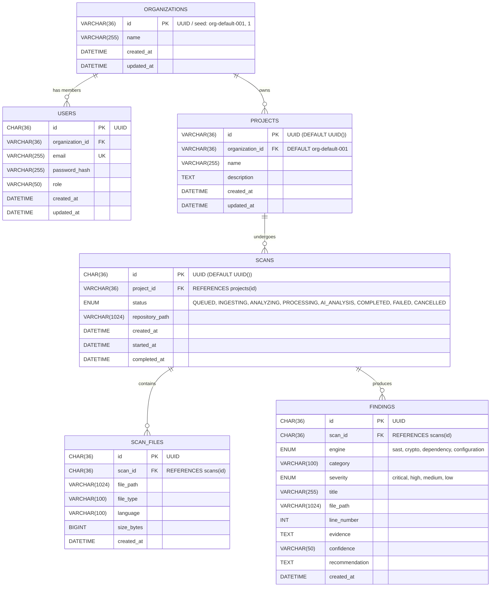

# PQC Security Assessment Platform — Database (Day 1)

**Owner:** Vamsi (Database Engineer)  
**Target Engine:** MySQL 8.0+  
**Database Name:** `pqc_security`  
**Git Branch:** `vamsi`

---

## 1. Architecture & Entity-Relationship (ER) Diagram



---

## 2. Table Specifications & Identifier Standard

### Identifier Standard
All entities (`organizations`, `users`, `projects`, `scans`, `scan_files`, `findings`) use standard **UUID strings (`VARCHAR(36)` / `CHAR(36)`)** with automatic MySQL generation `DEFAULT (UUID())`. This guarantees:
* Client-side offline generation for desktop shells.
* Seamless multi-agent asynchronous scanning without sequence contention.
* Zero ID collisions across air-gapped sync nodes.

### Seed Compatibility
The default organization seeds both `'org-default-001'` and `'1'`, ensuring full compatibility with both string-based and legacy numeric references.

---

## 3. How to Run & Verify

### Option A: Local PostgreSQL & pgAdmin (Recommended for Lab / Desktop Setup)
* **Status:** Fully supported. Uses the local PostgreSQL service (`localhost:5432`).
* **Database Name:** `pqc_security`
* **Schema Script:** [`database/schema_postgres.sql`](file:///d:/Projects/PQC/PQC-Platform/database/schema_postgres.sql)
* **Seed Script:** [`database/seed_postgres.sql`](file:///d:/Projects/PQC/PQC-Platform/database/seed_postgres.sql)

To initialize and verify with Python:
```bash
python database/verify_db.py
```

To view or manage in **pgAdmin**:
1. Open **pgAdmin**.
2. Connect to your local PostgreSQL server (`localhost:5432`).
3. Expand **Databases** -> **pqc_security** -> **Schemas** -> **public** -> **Tables**.
4. You will see all 6 core tables: `organizations`, `users`, `projects`, `scans`, `scan_files`, `findings`.

---

### Option B: Start MySQL with Docker Compose
If Docker Desktop is installed:
```bash
docker compose up -d mysql
```
*Port:* `127.0.0.1:3306` (Localhost restricted for security)  
*Default User:* `pqc`  
*Default Password:* `change_me_locally`  
*Database:* `pqc_security`

---

### Step 2: Run the Verification Script
```bash
python database/verify_db.py
```
Automatically detects PostgreSQL first, then MySQL, or falls back to SQLite for schema validation.

